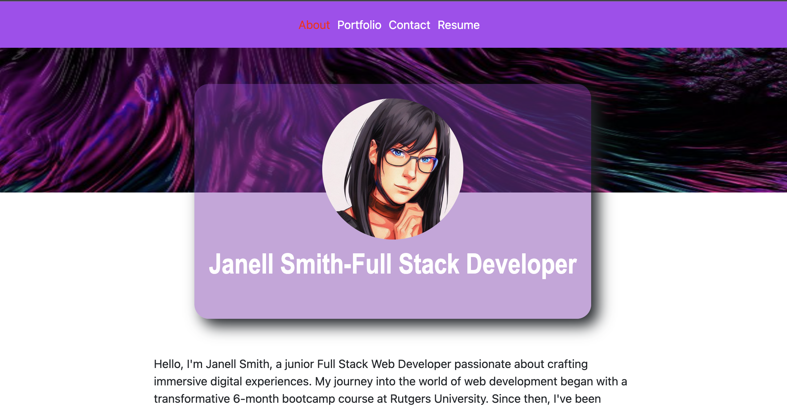

# React Portfolio

This is a portfolio website built using React, showcasing projects, personal information, and contact details. The website is designed to highlight skills, experience, and creative work in the field of web development.

## Table of Contents

- [About](#about)
- [Features](#features)
- [Installation](#installation)
- [Usage](#usage)
- [Technologies Used](#technologies-used)
- [Screen Shot](#screen-shot)
- [Walk Through Video](#walk-through-video)
- [Link to Deployed App](#link-to-deployed-app)
- [Contributing](#contributing)
- [Credits](#credits)
- [License](#license)

## About

The React Portfolio is a single-page application (SPA) created to display a junior Full Stack Web Developer's expertise, projects, and a glimpse of personal information. It features sections like:

- **About Me**: An introduction to the developer, including background, skills, and aspirations.
- **Portfolio**: Showcasing projects, potentially with detailed descriptions or case studies.
- **Contact**: A form for visitors to reach out, providing an avenue for communication.
- **Resume**: Displaying the developer's resume or a link to it.

## Features

- **Dynamic Content**: Utilizes React to dynamically render content based on user interaction.
- **Responsive Design**: Ensures the website is accessible and looks good across various devices and screen sizes.
- **Bootstrap Integration**: Uses Bootstrap for styling to maintain consistency and streamline UI development.
- **Contact Form**: Provides a means for visitors to send messages or inquiries directly.

## Installation

1. Clone the repository locally using `git clone 'https://github.com/jellobear27/react-portfolio'`.
2. Navigate to the project directory.
3. Run `npm install` to install project dependencies.

## Usage

1. Run `npm start` to start the development server.
2. Open your browser and go to `http://localhost:3000` to view the website.

## Technologies Used

- React
- Bootstrap
- React-Bootstrap
- React PDF
- Vite (for development)

## Screen Shot

## Walk Through Video
[![Watch the video]](https://drive.google.com/file/d/1RaSTqs47k0xJVzLEHV1X0KVTTychbUYp/view?usp=sharing)

## Link to Deployed App
[![Deployed App]](https://main--helpful-meerkat-0154c9.netlify.app/)

## Contributing

Contributions are welcome! If you find any issues or have suggestions for improvement, feel free to submit a pull request. Make sure to follow the existing code style and maintain consistency.

## Credits
- **Author:** Janell Smith GitHub: https://github.com/jellobear27

## License

This project is licensed under the [MIT License](LICENSE).

